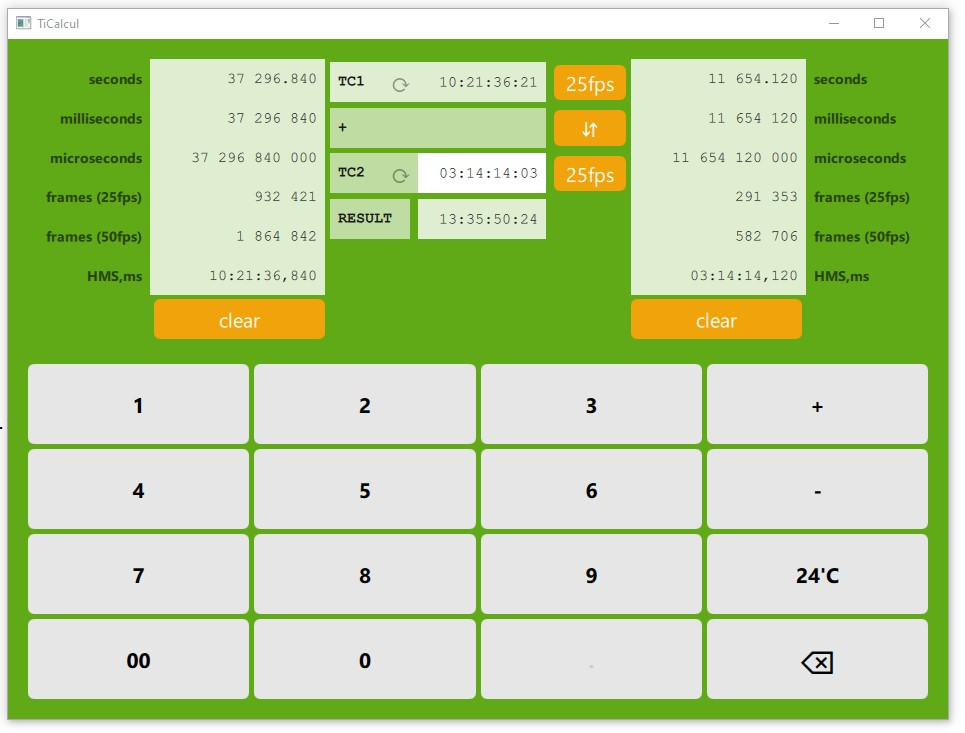

# TiCalcul

TiCalcul est une **calculatrice de timecodes** pour Windows.  

La version Android, **TcCalcul**, n'est plus disponible sur le *Playstore* de Google depuis 2024, mais son *APK* est téléchargeable sur [le site de TcCalcul]().

