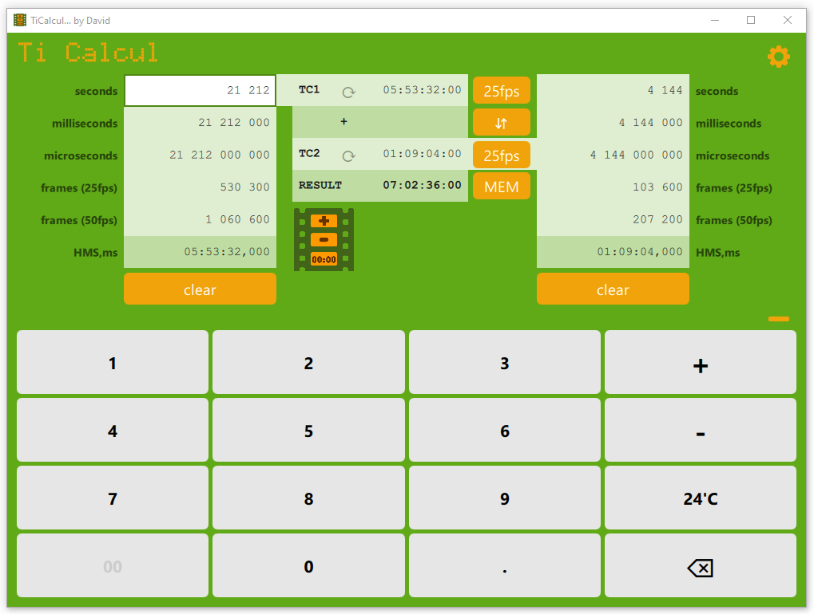

# TiCalcul for Windows

## Description

**TiCalcul** is a free and Ad-free video timecode calculator.

**Available Now !**

Get the latest release of the software by [clicking here](https://github.com/Sphinkie/TiCalcul/releases/latest/download/TiCalculSetup.exe)

## Features

With TiCalcul, you can:

* add timecodes up to 99999 hours
* get the difference between two timecodes
* calculate the complement to 24 hours of a given timecode
* use a keyboard or a touch-screen
* switch to darkmode

## Installation

Get the latest release of the software by [clicking here](https://github.com/Sphinkie/TiCalcul/releases/latest/download/TiCalculSetup.exe)

Download the **TiCalculSetup.exe** file, and just run it to install the program.

## Developper corner

Developpers can access to TiCalcul 2.0 *Qdoc* documentation [here](https://sphinkie.github.io/TiCalcul/qdoc/html/ticalcul-module.html).

TiCalcul 1.0 *Doxygen* documentation is also available [here](https://sphinkie.github.io/TiCalcul/doxygen/html/index.html).

